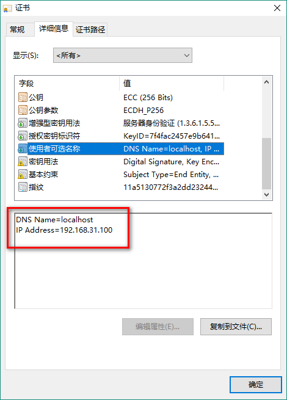

# tour-plan
一个旅游计划的移动端小页面，完成信息课作业~

## Project setup
```
npm install
```

### Compiles and hot-reloads for development
```
npm run serve
```

### 关于本地SSL  
**开发环境开启了https**，也就是给localhost配置了ssl，因为是本地自签发证书所以需要自行配置；参见 [mkcert](https://github.com/FiloSottile/mkcert)；  
webpack开启https配置文件在vue.congfig.js中有写  
**注意**：配置的SSL证书必须匹配localhost和IP，因为webpack的一个sock通信使用的是https://192.168.xxx.xxx这样的链接，只匹配localhost会导致控制台疯狂报错。。。。  
  
```
# 对应的代码
 .\mkcert-v1.3.0-windows-amd64.exe -ecdsa localhost 192.168.31.100
```


### 测试图片展示
--- --- 
1. 使用本地相对路径./readme_img/favicon_600.png  


### 费用
--- ---
1. 高铁去：109.5 * 6 = 657----------657
2. 地铁+橘子洲：（4+60）*6 = 384----------1041
3. 住宿三晚：585----------1626
4. 公交+海底世界：（5+65）*6 = 420----------2046
5. 南门口：（5+200）*6= 1230----------3276
6. 长沙世界之窗：（5+175）*6=1080----------4356
7. 湖南大学：0----------4356
8. 高铁走：109.5 * 6 = 657----------5013

